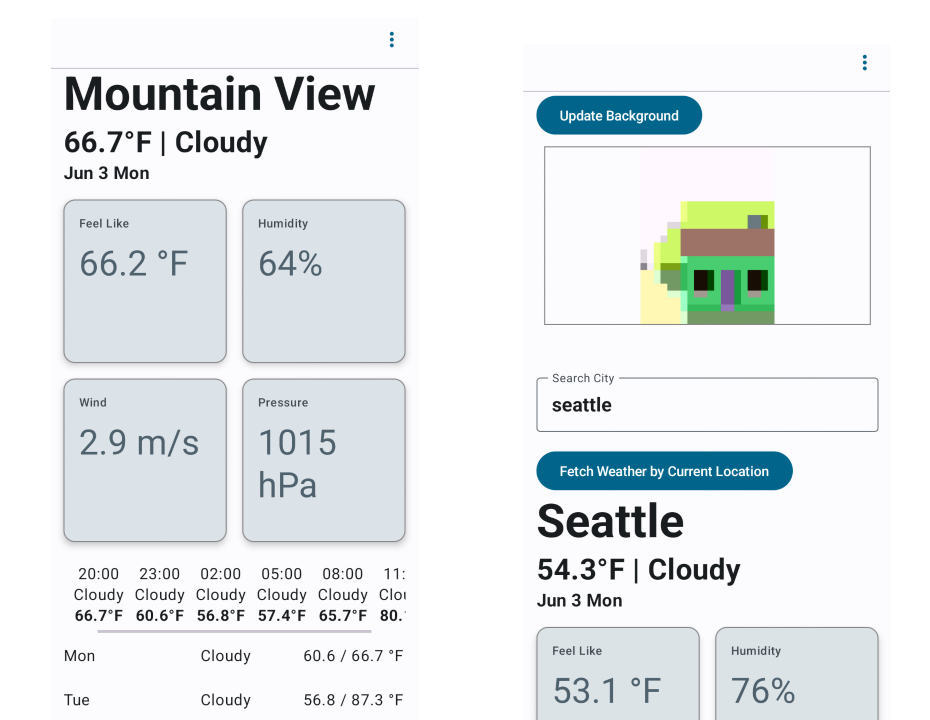
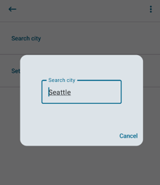

# Weather app

## Overview
This Android application provides real-time weather updates and forecasts for the next five days. The app fetches data from the OpenWeather API via personal API key, processes this data, and presents the current weather along with a 4-day forecast. Weather details include temperature, humidity, pressure, wind speed, and sunrise/sunset times, providing a comprehensive overview of weather conditions.

## Development Details
- Time to Complete: Approximately 6 hours were dedicated to the development of this application.
- Main Functionality:
  - Display the current weather and temperature.
  -	Future days weather forecast.
  -	Display additional detailed information such as humidity, pressure, wind speed, sunrise, and sunset times.

## Challenges
The most challenging part of developing this application was processing and managing the data fetched from the OpenWeather API. Integrating the API was straightforward, but ensuring the data was accurately parsed, properly managed, and effectively used to update the UI required meticulous attention to detail. Specifically, translating the JSON responses into usable formats within the app and updating the UI without performance degradation were complex tasks. Additionally, implementing a mechanism to forecast the weather for future days, rather than just the current date(as per homework assignment requirement), introduced added complexity in data handling and UI management. 

I also tried using Jetpack, a more modern way to compose the UI instead of using the traditional Android XML layout methods to update the UI.

## UI Design
Figma Prototype Design link: https://www.figma.com/design/8uIkmYZpknZKzVtqyOgLnZ/Weather-Display-App?node-id=0%3A1&t=qJaF7JO92u38OBeO-1

## Screenshots

## References
- [Android Developers Guide](https://developer.android.com/guide)
- [Jetpack Compose Overview](https://developer.android.com/jetpack/compose)
- [OpenWeather API](https://openweathermap.org/api)